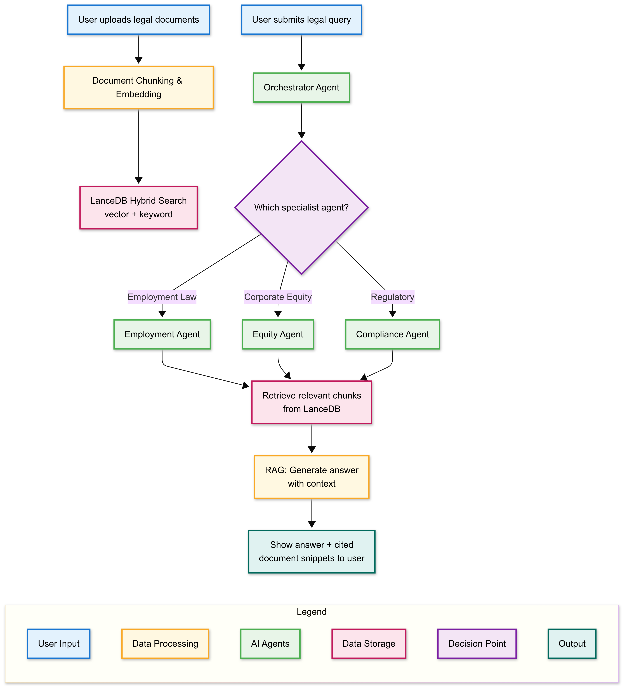
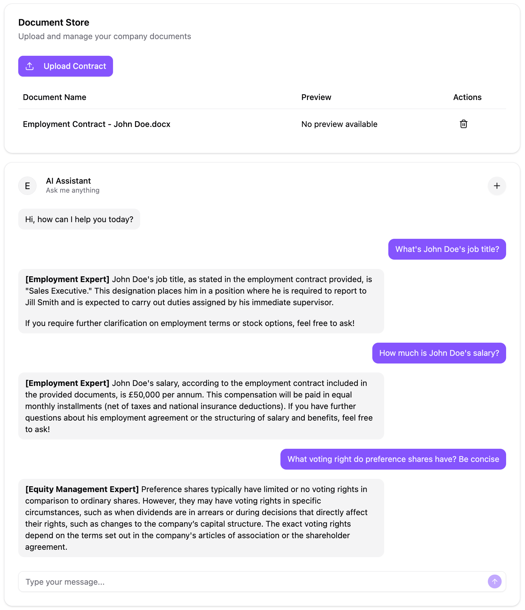
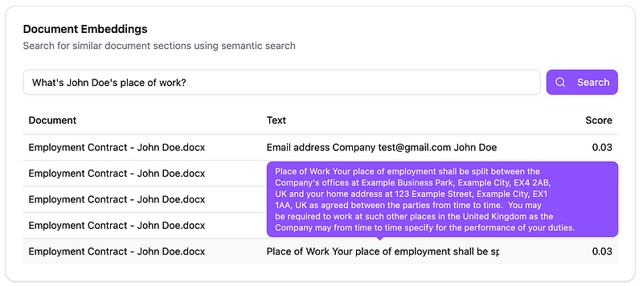

# Agents Platform

<div align="center">
  
  <div><em>High-Level Solution Architecture</em></div>
  <br/>
  
  <div><em>Chat Interface Demonstration</em></div>
  <br/>
  
  <div><em>Document Embeddings Debugging Demo</em></div>
</div>
<!-- Optionally, add a project logo/banner above:  -->

## Table of Contents
- [Overview](#overview)
- [Repository Structure](#repository-structure)
- [Backend – FastAPI / Azure OpenAI](#backend--fastapi--azure-openai)
- [Frontend – React + TypeScript + Vite](#frontend--react--typescript--vite)
- [Local Development](#local-development)
  - [Backend](#backend)
  - [Frontend](#frontend)
- [Docker & Container Workflow](#docker--container-workflow)
- [Cloud Deployment (Azure)](#cloud-deployment-azure)
- [Environment Configuration](#environment-configuration)
- [Infrastructure as Code](#infrastructure-as-code)
- [Debugging & Monitoring](#debugging--monitoring)

---

## Overview
A full-stack AI-powered application that blends:

* **FastAPI** backend exposing LLM-driven endpoints (querying, RAG, document vectorisation).
* **Azure OpenAI** for GPT-4-based orchestration and Ada-002 embeddings.
* **LanceDB** vector database for hybrid search.
* **React + TypeScript + Vite** SPA for the user interface.
* **Azure App Service & Bicep templates** for one-command infrastructure deployment.

---

## Repository Structure
```
/                   Root of the repo
│
├─ ai-engine/       FastAPI backend + RAG helpers + infra scripts
├─ frontend/        React client (Vite)
├─ infra/           Bicep IaC templates (referenced from backend docs)
├─ images/          🖼️  Place project screenshots / diagrams here
└─ tests/           Pytest test-suite for backend agents
```

---

## Backend – FastAPI / Azure OpenAI
Key capabilities:

* **/query** – routes a natural-language query to the appropriate legal specialist agent (Employment, Compliance, Equity).
* **/vectorize-document** – upload a `.docx` and ingest its content into LanceDB.
* **/embeddings** – hybrid search over vector + FTS indices.
* **/documents** – list, delete documents.

See `ai-engine/app.py` for full API spec.

### Running the backend locally
```bash
cd ai-engine
python -m venv venv && source venv/bin/activate
pip install -r requirements.txt
# populate .env first (see below)
python app.py  # serves on http://localhost:8000
```

---

## Frontend – React + TypeScript + Vite
The `frontend/` folder is a standard Vite project.

### Development server
```bash
cd frontend
npm install   # or pnpm/yarn install
npm run dev   # http://localhost:5173 by default
```

### Production build
```bash
npm run build   # outputs to frontend/dist
```

---

## Local Development
### Backend
1. Copy `.env.example` → `.env` (create `.env.example` if it doesn't exist – see variables below).
2. Activate virtualenv & install deps.
3. `python app.py` (or `uvicorn app:app --reload`).

### Frontend
1. `npm install`
2. `npm run dev`
3. Configure proxy or environment variables if the API is not served from the same origin.

---

## Docker & Container Workflow
Build and run everything in Docker:
```bash
# build backend image
cd ai-engine
docker build -t agents-backend .
# run
docker run --env-file .env -p 8000:8000 agents-backend
```

---

## Cloud Deployment (Azure)
The Bicep templates under `infra/` provision:
* Azure Container Registry
* Azure App Service (Linux) with system-assigned identity
* Key Vault for secrets (OpenAI key, LanceDB credentials, custom API key)

Example first-time deployment:
```bash
az deployment group create \
  --resource-group MY-RG \
  --template-file infra/main.bicep \
  --parameters @infra/parameters.dev.json
```
After pushing a new image to ACR, restart the Web App:
```bash
az webapp restart --name agents-dev --resource-group MY-RG
```

---

## Environment Configuration
These variables **must** be provided (e.g. via `.env` in local dev or Key Vault in Azure):
```ini
# API
API_KEY=super-secret-api-key
DEBUG_MODE=true          # false in prod

# Azure OpenAI
AZURE_OPENAI_KEY=<key>
AZURE_OPENAI_ENDPOINT=https://<your-endpoint>.openai.azure.com/
AZURE_OPENAI_VERSION=2023-05-15
GPT4_DEPLOYMENT_NAME=gpt-4
EMBEDDING_DEPLOYMENT_NAME=text-embedding-ada-002

# LanceDB
LANCEDB_URI=az://lancedb
LANCEDB_ACCOUNT_NAME=<storage-account>
LANCEDB_ACCOUNT_KEY=<storage-key>
```

---

## Infrastructure as Code
* `infra/main.bicep` – App Service + container config
* `infra/keyVaultModule.bicep` – secrets & identity wiring
* `infra/updateAppSettings.bicep` – reference secrets from Key Vault in App Service config

---

## Debugging & Monitoring
* **Health Check:** `GET /health`
* **Latency header:** each request includes `X-Process-Time`.
* **Streaming logs (Azure):** `az webapp log tail --name <app> --resource-group <rg>`

---

### Contributing
1. Fork & create a feature branch.
2. Run linters/tests (`pytest`, `eslint`, `prettier`).
3. Submit a PR.

---

© 2025 Agents Platform – MIT licence 